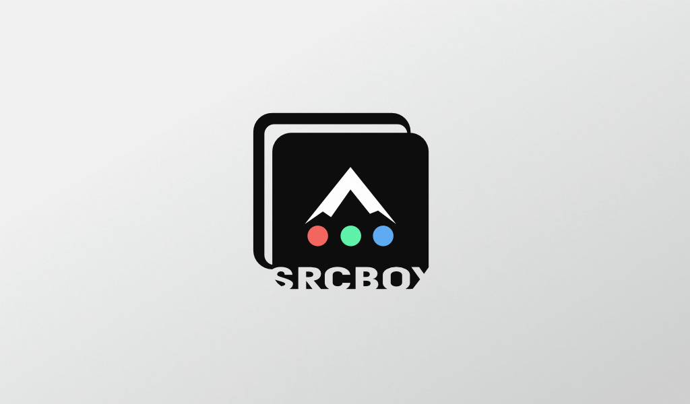

<h3 style="text-align: center">
<i>
a blog about overthinking the overlooked & understanding the under-rated
</i>
</h3>

##### hi there
##### hi there
##### hi there

`src_box` is an experimental blog focussing on interesting ideas. While the topics discussed will likely fall on the more technical end of the spectrum, I want this medium to be a scratch pad for exploring many interesting ideas.

The idea of which is the blog's medium and format itself.

 

# Git for Blogging
I've had the idea for a while now that `git` could be a great medium for blogging. It strays away from the standard format seen almost universally and has some intriguing abilities opening doors for extended uses in the blog format. 

## The Format
Posts will be written in [markdown](https://daringfireball.net/projects/markdown/syntax) as well as [jupyter notebooks](https://jupyter.org/). This will allow easy post writing with access to drop in raw html if need be as well as write out interactable posts that could be cloned by the reader and explored in their own environment. A side benefit with some git clients like `github` is the fact that markdown and jupyter notebooks are rendered on the site, making them nice to view for readers.

Many technical blogs often attach extra files or project code and require the user to download compressed content or navigate to a location like github to view the code. the benefit of reading the blog on the repo means that the reader is already at the place where a large majority of source code and exmple files will reside. 

## Subscribable... Sort Of...
Another interesting feature of `git` is the ability to `pull` and `checkout` source material. This allows a reader to asyncronously interact with the blog by pulling the blog repo and getting any updates that were made. This is not true subscription where a publisher sends updates to the subscriber, but still provides a way to instantly get "whats new" with a simple command (which could be automated to auto pull everyday).

## Living Content
One of the most interesting aspects of `git` as a blogging medium to me is the fact that commits track any data that was changed and `git log` allows for viewing these changes in order.

This means that if a post made today needs to be modified 2 years later, this content now shows up at the top of the `git log` again. The added benefit here is that it is not only updated and treated as a new post, but all the old content is available as well by `checkout <old commit>`. This is quite unique in comparison to standard blogs where a new post is ussually the approach to updating material.

## Community Interaction
In addition to updating posts rather then replacing it, github pull requests can be used to catalog new posts, thereby giving each post a unique page in the requests log. If posts take time to put together or involve research time, its also possible to use the `open` and `closed` aspects of pull requests to indicate what posts are "_in the works_" vs. which ones are published.

Pull requests also allow for comments providing a way for posts to garner discussion.

Likewise, the issue board can be used to discuss community questions, improvements to code examples, suggested topics and other use cases.

The Pull Requests and Issues both utilize a `labels` system. These labels can be layed out as described below to better suite the repo to blogging.

- `BlogPost` - primarily for pull requests that represent posts
- `Question` - indicates an issue is a question
- `Improvement` - when an improvement to some post or example could be made
- `Suggestion` - indicates an issue is proposing a topic
- `Bug` - indicates theres a bug in an example

## So Thats It?
Yep... pretty much. Disappointed? Intrigued? Want to go out and try this yourself? Either way, this is the idea that powers this blog project. Hope to see you again soon!

<h5>Author: Robby Boney</h5>
