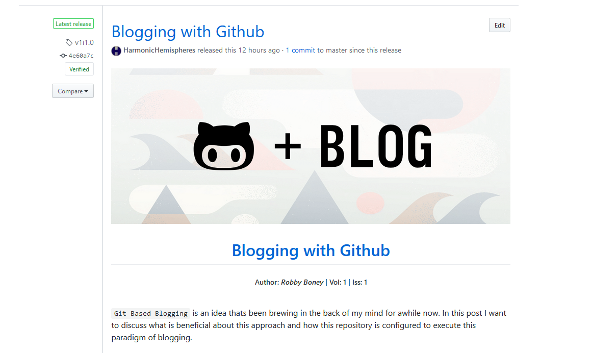

<h1 align="center">
Blogging with Github
</h1>
<h5 align="center">
Author: <i>Robby Boney</i>  |
Vol: 1 |
Iss: 1
</h5>
<br>


`Git Based Blogging` is an idea thats been brewing in the back of my mind for awhile now. In this post I want to discuss what is beneficial about this approach and how this repository is configured to execute this paradigm of blogging.

I like to think of blogs as mediums for sharing and documenting information. Typically using a written format, blogs are a great way to express yourself and your ideas. To express ideas smoothly and understandably for readers there are some valuable aspects that enhance the blog experience:
* posts are labeled with topics so readers can find content that interests them
* posts are organized by date so readers get a sense of when the information started
* posts can be commented on, to enable community reaction and discussion
* posts contain valuable and accurate information for the reader
* posts or content channels in the blog can be subscribed to so readers can come back only when new content is available
* posts with outdated content can easily be flagged or updated to let readers know about its relevancy (i.e. `How to print in Python` may be irrelevant once python 3+ was released)
* post content needs to look good for readers to fully enjoy the "blog experience" 

Now lets talk about how Git Based Blogging touches on these attributes.

<br>
<br>

# Benefits of using Git

[Git](https://git-scm.com/) along with [Github](https://github.com/) provide some really intriguing features that appeal to scientific and technical blogging. It's version control and automation focus are ideal for _Continuous Content_ and community aspects mentioned above.

<br>

__Continuous Content__ can be defined as:

> __Continuous Content__: _written content that is continuously updated rather than archived and replaced once it is stale_

This type of content is probably the biggest difference from traditional blogging content. Inspired from concepts in DevOp's of Continuous Integration and Continuous Deployment, it is a very useful attribute for written technical content because most fields evolve so fast. Simply read through the [Nature Journal](https://www.nature.com/) or the [Rust Programming Language's Changelog](https://github.com/rust-lang/rust/blob/master/RELEASES.md) and you will find miles of brilliant researchers making new discoveries and programmers inventing more efficient software solutions. In this day and age staying updated is hard because the cutting edge moves so fast and reading an article hoping it will be updated "enough" is an inefficiency. The fact that `git` is a version control software with a rich feature set, means old content can be updated but older versions are still accessible. This blog seeks to take advantage of that by keeping content "updated". New or additional content, wont be thrown into a new post, but will be tagged onto an existing post if applicable, creating a new version.

The added benefit of Github is that there are a few ways to view content depending on what the reader is interested in.

* `Live Content` - the most updated official version of content 
    * this can be handled on the `master` branch
* `Cutting Edge Content` - the most updated version of content
    * this can be handled on experimental [Idea Branches](#branches)
* `Snapshot Content` - content exactly how it was when published
    * this can be handled with [git tags](https://git-scm.com/book/en/v2/Git-Basics-Tagging) and [releases](https://help.github.com/en/github/administering-a-repository/managing-releases-in-a-repository)
* `Live Snapshot Content` - content that tracks new published changes as separate snapshots
    * this can be handled with github issues left open and added to when new versions of a specific post are published


<br>

__Content Management__

Github provides native rendering support for `markdown`, `markdow+html` and `jupyter notebooks`. This is great because posts down have to use pictures or extracts from the source material, they can simply be written as intended and displayed or stored in github. The markdown support is also nice because it is a fairly standard writing format and quite easy to use. 

`Jupyter Notebooks` provide an excellent addition to markdown for interactive blog posts or posts focused on mathematics. This is because notebooks are interactive by default when run locally on in a cloud environment like [binder](https://mybinder.org/), and also support latex for math equations. This adds to the nicety of using Git Based Blogging for scientific blogs.

<br>

__Powerful Community Tools__.

Github provides methods for community engagement out of the box like [issues](https://help.github.com/en/github/managing-your-work-on-github/about-issues) which can be labeled and searched in the issue board and allow community discussion. In addition to that, if any reader struggles with example code or doesn't understand major concepts, they could simply open new issues using a [reader label](#labels) that can help the author and community better categorize blog activity.

Github also provides insights as a way to track repository engagement which could be helpful for authors wanting to shape content around increased reader stats.

Aside from community insight and discussion, some authors may want to blog for monetary reasons. While [Medium]() or other subscription based blogging platforms might be better suited for this, Github also supports a [Sponsor Button](https://help.github.com/en/github/administering-a-repository/displaying-a-sponsor-button-in-your-repository) which could provide authors a upfront and non-intrusive way to take payments from supporting readers.

_Pull Requests_ are debatably the most powerful tool for community engagement on a blog. This is because they provide a way for content in the blog to be corrected and updated by the community and contributed back into the blog itself. Merges will also resemble author contributions as well, so theres no worry of losing proper acknowledgement. 

Another interesting use case for pull requests could be a group blog where multiple authors contribute to the same journal/blog. Using pull requests authors could easily work on their own ideas in a forked repo, and submit pull requests which a maintainer could merge in and publish when they wanted to.

<br>

__Git Automation Coolness__

`git` itself also provides some interesting tools for automating parts of the blog. For example [git hooks](https://git-scm.com/book/en/v2/Customizing-Git-Git-Hooks) provide a way to run scripts before, after or based on, commits and their content. This means that a commit to an [idea branch](#branches) containing the text `[merge-as-v2i23] commit message....` could trigger a hook that auto merged the branch into master and created a tag for the commit with the respective id.

<br>
<br>

# Configuration
This repo attempts to repurpose some of Github's features to appeal to a blogging format and hopefully provide an interesting case study on experimental uses for `git` and `Github`.

<br>

### __Volumes, Issues & the Issue board__
Each blog post represents a new topic or idea for the blog. These posts are contained into `volumes` which are numbered by year and called `issues`; similar to scientific journals. The reasoning for `volume` and `issue` is to draw familiarity for expected readers of this blog's technical topics.

Each Issue corresponds with an issue on Github's issue board to provide a place for readers to comment as well as subscribe in case any changes to that issue occur. Issues uses the `BlogPost` label (mentioned below) and the `Topic::<___>` labels to describe itself on the issue board.

<br>

### __Structure__
The blog is layed with each `volume` contained in its own folder with all its `issues`. All example code and post specific content is located in that issue's folder. Using this structure and Github's markdown format, the repo is setup to let readers navigate from the readme to any blog post without having to navigate the files and folders.

```
readme.md
vol-1/
    overview.md            - describes the volume and gives links to issues
    issue-1/
        post.md            -+---- the post.? is the primary post file
    issue-2/                |
        post.ipynb         -+
        pyexample.py       - an example script
```

<br>

### __Labels__
Github labels are used to help categorize issues as well as provide methods for readers to filter the issue board better.

* `BlogChannel` - is used exclusively on issues designed to be "topic feeds" which will continuously be updated when new posts are added to it. Comments are disabled on these issues and provide readers a way to subscribe to only certain types of content in the blog.
* `BlogPost` - used for issues that represent a blog post
*  `bug, improvement, question` - these are reader labels, meant to signify a type of forum discussion related to the blog
* `topic::[____]` - these are for posts and channels to give readers more filtering power from the issue board filter search

<br>

### __Commits__
Commits are named in a way that are clean to read and enable `git hooks` (when i get around to setting it up) to do powerful automation like auto publishing or updating issues.

<br>

_regular changes: (`add | change | improve | remove`)_
```
format:      [[change type]] [message]
example:     [add] new pages added to v2i45.1 
```

_special commits for git hooks_
```
format:      [merge-as-[issue id]] [message]
example:     [merge-as-v4i3] finally publishing this post

format:      [[change type]][[flag]=[value]]+  [message]
example:     [improve][alert=Subs][build] sped up rust example build speed greatly..... 
```

<br>

### __Branches__
Branches are a great tool for keeping "official code" separate from "in progress" code. For this blog, `master` branch is dedicated to the official blog content (standard git process) and any new post ideas in the works are developed on separate branches following the naming convention below (adapted from [Git flow process](https://datasift.github.io/gitflow/IntroducingGitFlow.html)). This first blog post is the only exception to this rule. Using branches this way allows eager readers to see content in the works as well provides a clean `git log` for official posts on `master`

<br>

_New blog post ideas that have not been published use the __branch__ naming:_
```
format:     idea-[topic or name]
example:    idea-odd_python_funcs
```

_Blog post ideas for revisions will use the __branch__ naming:_
```
format:     idea-[issue id]-update
example:    idea-v1i1-update
```

_Published issues are __tagged__ with the naming:_
```
format:     v[volume number]i[issue number].[issue version]
example:    v3i23.1
```

<br>

### __Releases__
Releases will be used for to highlight published snapshot content, linking to the exact tag for the post (i.e. `releases/tag/v1i1.0`). This is where issues will differ by tracking all the versions of issues rather then individual tags. Releases are also subscribable, thereby acting as a 'news feed' for new or updated posts.

[](https://github.com/HarmonicHemispheres/src_box/releases/tag/v1i1.0)

<br>
<br>

# Conclusion
Hopefully this post has outlined an interesting new take on blogging and providing some adaptions to the Github feature-set for a modern blogging experience.


Thanks for reading and come again!
