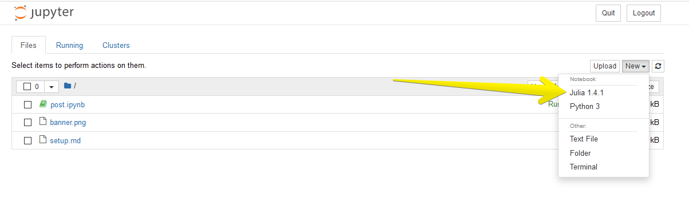

<h1 align="center">
Setup Julia with iJulia Kernal
</h1>
<h5 align="center">
Author: <i>Robby Boney</i>  |
Vol: 1  |
Iss: 2  |
</h5>
<br>
<br>


## Installing Julia
First download and install `julia` from [here](https://julialang.org/downloads/).

<br>

## Install Conda
[**isntall conda**](https://www.anaconda.com/distribution/) if you want to run jupyter from your own python environment.

> **NOTE:** If you install anaconda it will ship with `jupyter` but if you install
> with `miniconda` you can easily install `jupyter` with an [extra step](https://anaconda.org/anaconda/jupyter).

> **NOTE:** if you are on **Windows** and want to run conda on powershell, first add it to path
> then run `conda init powershell`, more details [here](https://stackoverflow.com/questions/47800794/how-to-activate-different-anaconda-environment-from-powershell)


<br>

## Installing The iJulia Kernel
now you can install the [**iJulia kernel**](https://github.com/JuliaLang/IJulia.jl).

<br>

## Run Jupyter with iJulia

```shell
$ jupyter notebook
```

once jupyter is running you can start new julia by creating a `julia` kernel.



<br>
<br>


## Bonus. Juno IDE!
If you want a full IDE experience with Julia, check out the Juno IDE, https://junolab.org/

